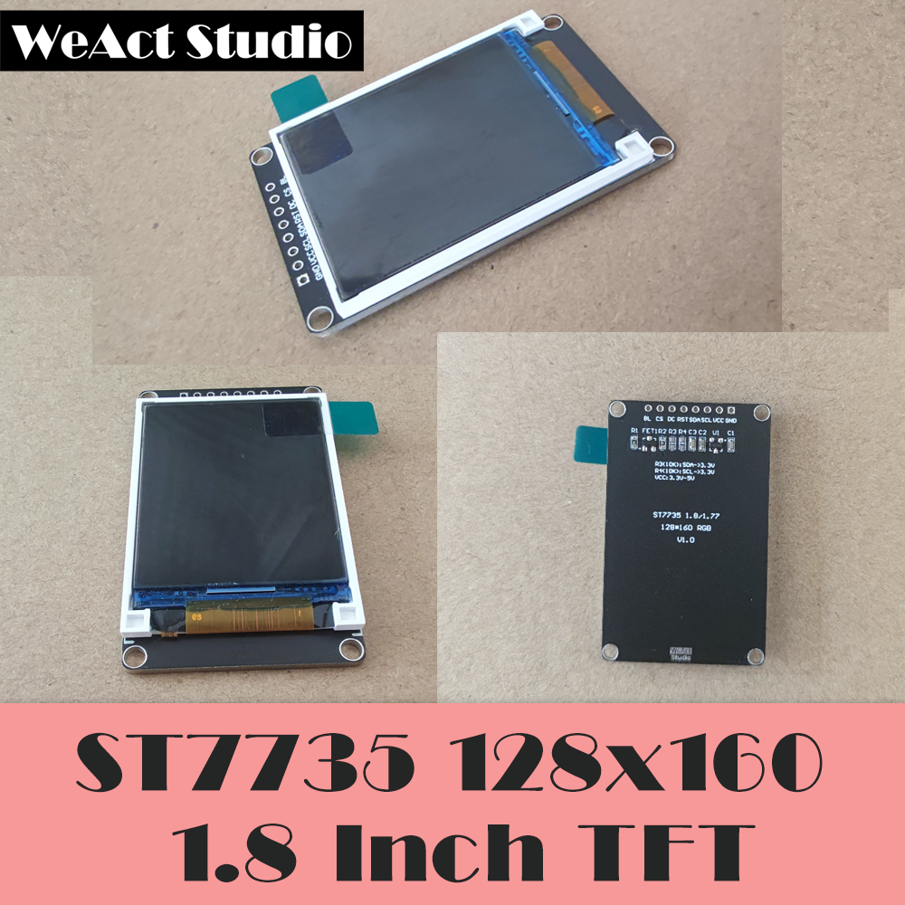

# ST7735 / WeAct Studio 微行工作室 出品

* [中文版本](./README-zh.md)

> `1.8 inch size screen 128 * 160 RGB`

> `Suitable for 5V 3.3V power supply`

>`PWM backlight control`

> `SPI control`

> `Length: 56mm width: 35mm`

> `STM32F103C8T6, STM32F401CEU6/STM32F411CEU6 C HAL library code.`

> `Micropython code`

To learn more about our studio's other products, please visit[WeAct-Studio-Product](https://github.com/WeActTC/WeAct-ST7735.git)

## Pin Set describe

|Pin Set|Describe|
| :--:|:--:|
|1.GND| Power GND|
|2.VCC| Power VCC avaliable 3.3V or 5V|
|3.SCL| SPI SPI clock input|
|4.SDA| SPI SPI data input|
|5.RST| Reset|
|6.DC| Data or Command Select|
|7.CS| SPI chip select input|
|8.BL| Back Light control input|

## Information directory description

|Dir|Describe|
| :--:|:--:|
|DataSheet| ST7735 datasheet|
|HDK| module schdoc and board shape|
|SDK| code link|
